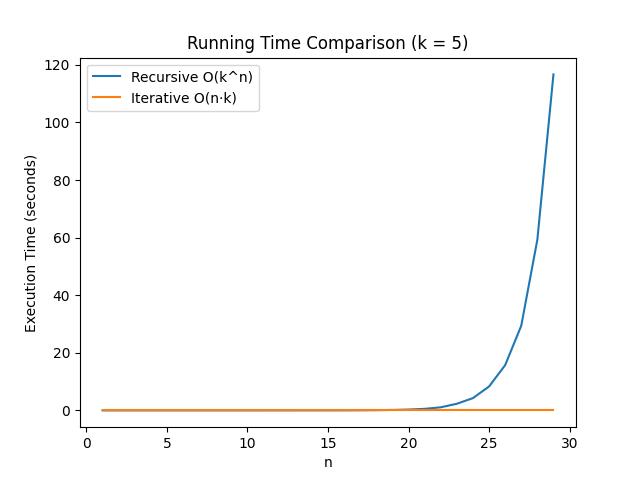

# Algorithm Complexity Analysis: K-Step Climbing Stairs
This repository contains a comparative analysis of Recursive vs. Iterative algorithms for the k-Step Climbing Stairs problem, a generalization of the Fibonacci sequence. This project was completed as part of the CAK2BAB2 - Analysis of Algorithm Complexity(Analisis Kompleksitas Algoritma) course at Telkom University.

# Repository Structure
-main.cpp = The main code for testing due to its speed over Python and handles massive integers with the Boost library..
-main_no_boost.cpp = The main code with only native packages for those without the extra packages but for big n inputs results may result in integer overflows(even if the ---integer type is "long long")
-aka_graph.py = For graph visualization of the code, hard coded to n <= 30 and k = 5.
-aka_py.py = The initial version, may be incomplete
-AKAFP.pdf = Technical report including $c_{op}$ calculations and comparative analysis.

# Prerequisites
-C++ Compiler: GCC/G++(MSYS2-MINGW64 for Windows) is what I use. MSVC, TCC, and whatever could be used but never tried.
-Boost Library(for C++): Required for main.cpp to handle results up to n=10,000(If you use iterative only OR only small n then recommended to use main_no_boost.cpp).
-Python 3.8+: Required for graphing and to test out the python version of the C++ code.(3.14 version is faster for me)
-Matplotlib(for Python): pip install matplotlib(only for graphing)

# Compilation & Execution 
### C++ = 
```g++ -I /path/to/boost main.cpp -o stairs_benchmark```, in my case it's ```g++ -I"C:\local\boost_1_90_0" main.cpp -o AKA.exe```
```./stairs_benchmark <n> <k> <type>```
-n: Number of stairs (e.g., 10000).
-k: Max steps per stride (e.g., 5).
-type: 0 for Recursive, 1 for Iterative.
### Python =
For the graph simply run ```python aka_graph.py``` and for the aka_py.py just run ```python aka_py.py``` in the same directory.

# Key Findings

Our analysis highlights the critical importance of algorithm selection:
- **Iterative Approach ($O(nk)$):** Processed $n=10,000$ in approximately **39 ms**(may be different each time and also depends on the hardware but this number is what I get the most).
- **Recursive Approach ($O(k^n)$):** For $n=10,000$, the estimated time is **$1.52 \times 10^{2941}$ ms** (Infeasible).

# References
-Neapolitan, R., & Naimipour, K. (2014). Foundations of Algorithms.
-Course Slides: Weeks 1-13, Analysis of Algorithm Complexity, Telkom University.
